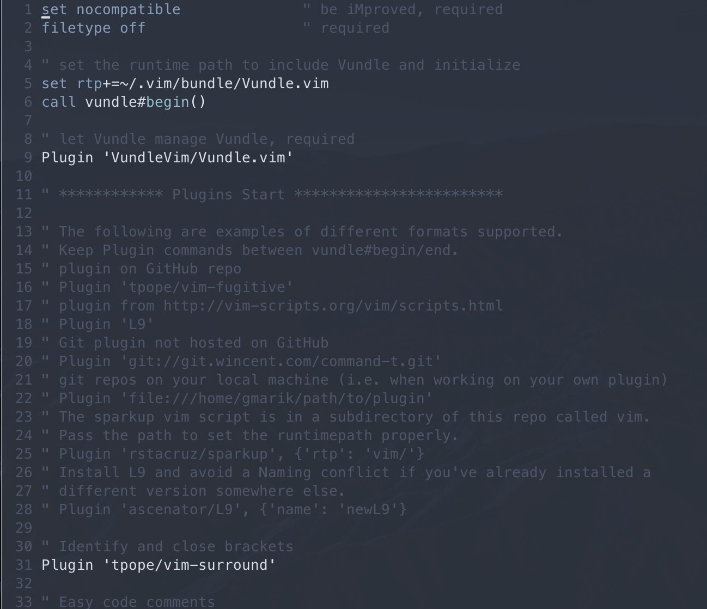
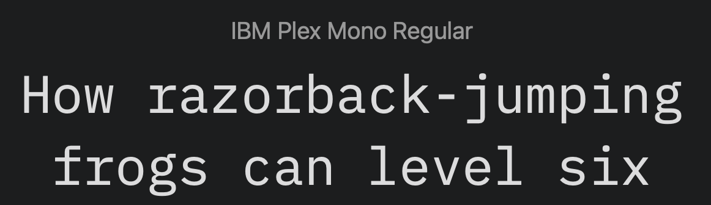

# Personal Configuration

## Color Scheme
Vim and iTerm color scheme build on [nord](https://www.nordtheme.com/) theme.

## Font
I personally prefer IBM Plex (Mono) and Source Code Pro.

## GNU-stow
I use `GNU-stow` for managing my dotfiles. It links to the `.rc` files in the 

### Credits and useful tutorials. 
